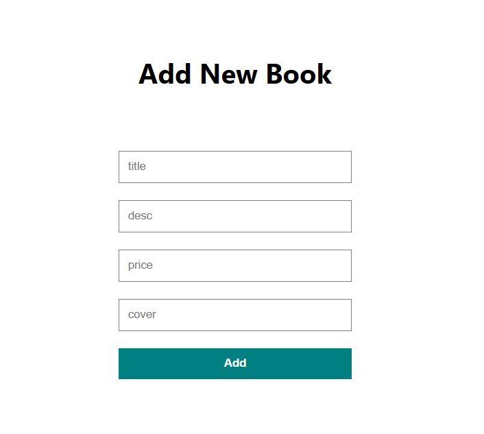

<h1 align="center">My bookshop</h1>
<!-- TABLE OF CONTENTS -->

## Table of Contents

- [Overview](#overview)
- [Features](#features)
- [Hvordan bruke](#hvordan-bruke)
- [Hva ble brukt](#hva-ble-brukt)
- [Contact](#contact)

<!-- OVERVIEW -->
## Overview
- Vi så på og følgte med på en tutorial som viste oss grunnleggende info om CRUD operasjoner.
https://www.youtube.com/watch?v=fPuLnzSjPLE&list=PLasOxVbcKSa2KF0jW150CZQiy3mWrNGFa&index=6

## Features
- Legge til data til database
- Hente data av databasen
- Slette data av databasen

## Hvordan bruke
- Må lastes ned og redigeres med egen database som referanse.
- Til å installere prerequisites må man bruke npm install på både backend og frontend folder. 
- Få legget til bøker og har mulighet til å oppdatere og slette bøker. 

## Hva ble brukt
- Frontend: HTML, CSS, Javascript
- Backend: Node.js, Express
- Database: MySQL

## Løsning
- YouTube video

## Contact
- GitHub [Ande-Glitch](https://github.com/Ande-glitch)
- Epost [And Nguyen](mailto:andynuwen@gmail.com)

## Result

